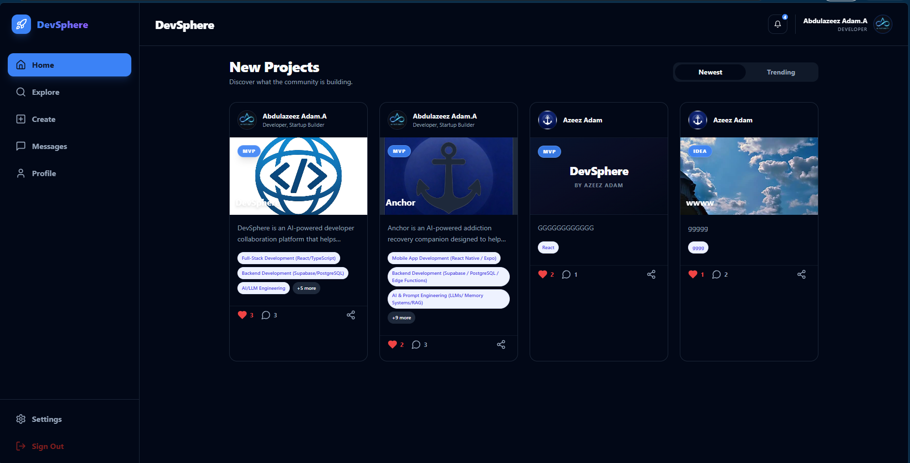
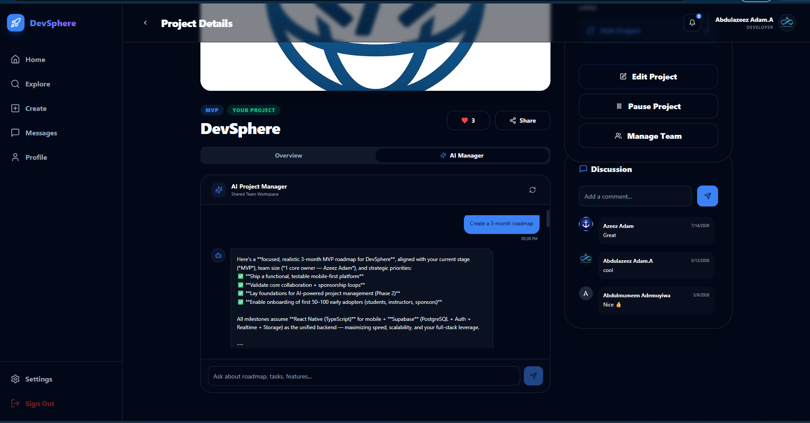
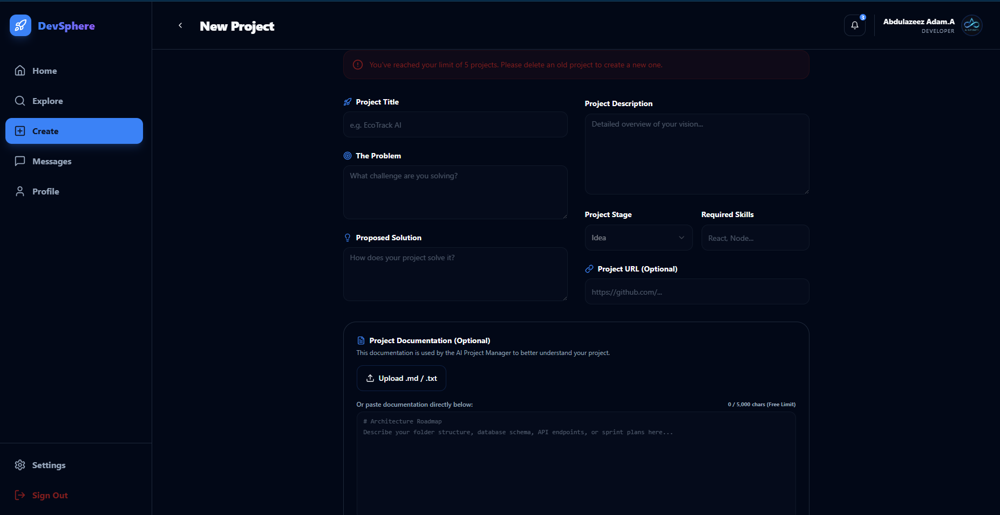
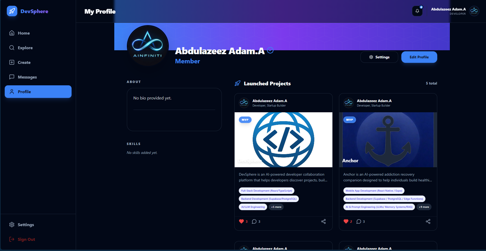

# 🚀 DevSphere -- Build Together. Ship Together.

**An AI-powered developer collaboration platform with a context-aware AI Project Manager powered by Alibaba Cloud Qwen-Plus.**

> *"DevSphere doesn't simply showcase ideas, it helps teams build them together."*

> *"DevSphere communicates with Alibaba Cloud Qwen models through the DashScope Workspace OpenAI-compatible API."*


##  🚀 OpenAI Build Week Scope

DevSphere is an existing developer collaboration platform.

During OpenAI Build Week, the focus was on extending the platform using GPT-5.6 and Codex rather than building a new application from scratch.

The new work includes Project Templates, Team Roles, Saved Projects, and Pinned Chat Messages, alongside architecture improvements, bug fixes, and UI refinements.

## 🚀 OpenAI Build Week Contributions

Although DevSphere existed before this event, the following functionality was designed and implemented during the OpenAI Build Week using GPT-5.6 and Codex:

- 📁 Project Templates for improved project organization and filtering
- 👑 Explicit Team Roles (Founder & Contributor)
- ⭐ Saved Projects
- 📌 Pinned Chat Messages for project conversations
- 🎨 UI polish and workflow improvements
- 🐞 Bug fixes and performance improvements

These additions were integrated into the existing architecture, tested locally, and deployed during OpenAI Build Week.

## AI-assisted Development

Throughout OpenAI Build Week, GPT-5.6 and Codex were used as engineering assistants for:

- feature planning
- implementation strategy
- React component refactoring
- SQL migration generation
- Supabase debugging
- architecture reviews
- UI refinement
- bug fixing
- code explanations
- implementation verification

All generated code was reviewed, adapted, tested, and integrated manually before deployment.

Codex accelerated development by:

- generating implementation plans

- refactoring React components

- writing and improving SQL migrations

- helping debug frontend and backend issues

- suggesting architecture improvements

- speeding up feature implementation while preserving developer control


All final engineering decisions, testing, integration, and verification were completed by the project author.


## 🛠 Development Workflow

The project was developed iteratively.

Typical workflow:


1. Define the feature.

2. Use GPT-5.6/Codex to explore implementation approaches.

3. Review and adapt generated code.

4. Integrate with the existing architecture.

5. Test locally.

6. Fix issues.

7. Deploy and verify.


## 🌍 The Problem

Modern software development is highly fragmented. Developers constantly switch between disconnected platforms—GitHub for code, Discord/Slack for chat, Notion/Trello for task tracking, and LinkedIn for recruiting. This fragmentation causes critical friction: finding reliable collaborators is difficult, promising startup ideas are abandoned when teams lose momentum, project knowledge is scattered, and onboarding new contributors is highly inefficient. Without structured guidance, teams suffer from scope creep and poor technical decisions. 

DevSphere solves these challenges by unifying project discovery, team formation, real-time communication, task management, and context-aware AI assistance into a single, integrated platform.

> *"DevSphere enables developers to discover projects, build teams, collaborate in real time, and receive context-aware AI guidance—all from a single platform."*
---


## 🧠 Context-Aware AI Project Manager

Every project interaction follows a complete project management lifecycle:
1. Retrieve project details (Problem, Solution, Stage, Skills)
2. Retrieve creator and team context
3. Identify the user's project role (Visitor, Applicant, Member, Owner)
4. Reason with Alibaba Cloud Qwen-Plus
5. Return actionable recommendations tailored to the current project

This ensures responses remain highly relevant instead of behaving like a generic chatbot.

### AI Capabilities

The Context-Aware AI Project Manager provides deep, actionable assistance across the entire project lifecycle:

* **Context-Aware Project Reasoning:** Answers questions about the project's core vision, problem statement, and proposed solution.
* **Role-Aware Recommendations:** Tailors advice based on whether the user is a visitor, applicant, team member, or project owner.
* **Sprint Planning & Roadmaps:** Helps organize development cycles, prioritize features, and set realistic milestones.
* **Task Breakdown & Architecture Guidance:** Deconstructs high-level features into granular tasks and recommends scalable folder structures, database schemas, and API designs.
* **Feature Prioritization:** Evaluates user-proposed ideas and provides objective technical reasoning on what to build first.
* **Onboarding & Contributor Assistance:** Generates customized onboarding guides and setup instructions for new contributors.
* **Risk Analysis & Technical Support:** Identifies potential technical risks, security vulnerabilities, and scalability bottlenecks.

### 🧠 How the AI Thinks

Every interaction with the Context-Aware AI Project Manager triggers a structured reasoning pipeline that ensures highly relevant, grounded responses:

```text
┌─────────────────────────────────────────────────────────┐
│                    Project Metadata                     │
│  (Title, Problem, Solution, Description, Stage, Skills) │
└────────────────────────────┬────────────────────────────┘
                             │
                             ▼
┌─────────────────────────────────────────────────────────┐
│                    Team Information                     │
│         (Founder Identity, Active Team Members)         │
└────────────────────────────┬────────────────────────────┘
                             │
                             ▼
┌─────────────────────────────────────────────────────────┐
│                User Role & Permissions                  │
│       (Visitor, Applicant, Team Member, Owner)          │
└────────────────────────────┬────────────────────────────┘
                             │
                             ▼
┌─────────────────────────────────────────────────────────┐
│                  Conversation Context                   │
│                 (Recent Chat History)                   │
└────────────────────────────┬────────────────────────────┘
                             │
                             ▼
┌─────────────────────────────────────────────────────────┐
│                 Supabase Edge Function                  │
│          (Secure Server-Side Context Assembly)          │
└────────────────────────────┬────────────────────────────┘
                             │
                             ▼
┌─────────────────────────────────────────────────────────┐
│                Alibaba Cloud Qwen-Plus                  │
│             (Contextual Reasoning Engine)               │
└────────────────────────────┬────────────────────────────┘
                             │
                             ▼
┌─────────────────────────────────────────────────────────┐
│                 Context-Aware Response                  │
│       (Actionable, Role-Tailored Recommendations)       │
└─────────────────────────────────────────────────────────┘
```

### Why Context Matters

Traditional AI assistants respond to isolated prompts. DevSphere instead assembles project metadata, team context, user roles, and recent conversations before invoking Qwen-Plus, producing recommendations that remain grounded in the current project rather than generic advice.

---

## 📱 Application Interface
> *"Screenshots currently showcase the desktop interface. A mobile-first experience is also available."*

### 🏠 Home Dashboard & 🤖 Context-Aware AI Project Manager
| Home Dashboard | AI Project Manager |
| :---: | :---: |
|  |  |

### 🔍 Create Page & 👥 Profile Page
| Create Page | Profile Page |
| :---: | :---: |
|  |  |

## 🎥 Demo

Live Demo:
https://dev-sphere-kappa.vercel.app/

Demo Video:
https://youtube.com/shorts/MDLwNpZrr4E

---

## ✨ Core Features

### ✨ Recently Added

- 📁 Project Templates
- 👑 Founder & Contributor Roles
- ⭐ Saved Projects
- 📌 Pinned Chat Messages

- 🤝 **Project Discovery:** Browse community projects, discover startup ideas, and search by skills, technologies, and stages.
- 👥 **Team Formation:** Request to join projects, accept or reject applicants, and manage project members and roles.
- 🤖 **Context-Aware AI Project Manager (Powered by Qwen):** Every project includes an intelligent AI PM that understands the project context before responding.
- 💬 **Real-Time Collaboration:** One-to-one messaging, project group chats, read receipts, and system events for team activity.
- 🔔 **Smart Notifications:** Receive alerts for join requests, approvals, team activity, messages, and project updates.
- 👤 **Developer Profiles:** Create a professional developer profile featuring skills, bio, portfolio, experience, and title.
- 🎁 **Referral System:** Invite developers to join DevSphere and earn referral points toward future platform rewards.

---

## 🌎 Primary Users

DevSphere is designed to support a diverse ecosystem of builders:

* **Student Developers:** Find peers to build course projects, portfolio pieces, or study groups.
* **Startup Founders:** Recruit early co-founders, validate MVPs, and organize initial product roadmaps.
* **Indie Hackers:** Launch side projects, find specialized collaborators, and get structured development guidance.
* **Open Source Contributors:** Discover active repositories, understand project architectures, and onboard smoothly.
* **Remote Engineering Teams:** Collaborate in real-time with integrated chat, notifications, and project tracking.
* **Hackathon Participants:** Form teams instantly, brainstorm features, and plan rapid development sprints.
* **Technical Communities:** Foster collaboration, share knowledge, and showcase community-driven projects.

---

## 🗺️ Developer Journey

The typical lifecycle of a developer on DevSphere follows a structured, collaborative path:

```text
┌─────────────────────┐
│  Developer Sign Up  │
└──────────┬──────────┘
           │
           ▼
┌─────────────────────┐
│   Create Profile    │
│ (Skills, Bio, Title)│
└──────────┬──────────┘
           │
           ▼
┌─────────────────────┐
│  Discover Projects  │
│ (Explore & Filter)  │
└──────────┬──────────┘
           │
           ▼
┌─────────────────────┐
│      Join Team      │
│ (Apply to Founder)  │
└──────────┬──────────┘
           │
           ▼
┌─────────────────────┐
│     Collaborate     │
│ (Group & DM Chats)  │
└──────────┬──────────┘
           │
           ▼
┌─────────────────────────────────────────┐
│    Context-Aware AI Project Manager     │
│ (Roadmaps, Task Breakdowns, Debugging)  │
└──────────┬──────────────────────────────┘
           │
           ▼
┌─────────────────────┐
│   Sprint Planning   │
│ (Milestones & Tasks)│
└──────────┬──────────┘
           │
           ▼
┌─────────────────────┐
│    Build Product    │
│ (Code & Collaborate)│
└──────────┬──────────┘
           │
           ▼
┌─────────────────────┐
│    Launch Project   │
│ (Publish to Sphere) │
└─────────────────────┘
```

---

## 🏗️ AI System Architecture

DevSphere's end-to-end AI and collaboration architecture is illustrated below:

```text
┌──────────────────────────────────────────┐
│             React Frontend               │
│   Home • Explore • Create • Chat • Team  │
└──────────────────┬───────────────────────┘
                   │
                   ▼
        ┌────────────────────────┐
        │  Supabase Auth (JWT)   │
        └───────────┬────────────┘
                    │
                    ▼
        ┌────────────────────────┐
        │ PostgreSQL Database    │
        │ • Profiles             │
        │ • Projects             │
        │ • Join Requests        │
        │ • Messages             │
        │ • Notifications        │
        │ • Referral Points      │
        └───────────┬────────────┘
                    │
                    ▼
      ┌────────────────────────────────┐
      │ Supabase Edge Functions        │
      │ • project-manager              │
      └───────────────┬────────────────┘
                      │
                      ▼
      ┌────────────────────────────────┐
      │ Alibaba Cloud DashScope API    │
      └───────────────┬────────────────┘
                      │
                      ▼
      ┌────────────────────────────────┐
      │ Qwen-Plus AI Reasoning         │
      │ • Project Awareness            │
      │ • Role-Based Intelligence      │
      │ • Contextual Reasoning         │
      │ • Secure Design                │
      └───────────────┬────────────────┘
                      │
                      ▼
┌──────────────────────────────────────────┐
│      Live Dashboard & AI Project PM      │
│  Roadmaps • Task Lists • Chat • UI       │
└──────────────────────────────────────────┘
```

1. **Project Setup:** Users create or join projects, establishing their roles and permissions.
2. **Contextual Reasoning:** Supabase Edge Functions (Qwen-Plus) analyze the project metadata, factoring in the user's role and permissions.
3. **State Synthesis:** The AI updates the project's roadmap, task lists, and sprint plans, providing fresh insights and recommended actions on the dashboard.

---

## 🛠️ Engineering Challenges Solved

* **State Synchronization across AI Conversations:** Solved by designing a server-side context assembly layer in Supabase Edge Functions that queries the database in real-time before invoking the AI. This ensures the AI always has access to the latest project metadata, team memberships, and user roles without overloading the context window.
* **Role-Aware AI Reasoning:** Designed a system prompt that dynamically adapts the AI's persona, permissions, and output style based on the user's relationship to the project. This prevents visitors from seeing private planning details while giving owners advanced sprint planning tools.
* **Grounding AI Responses to Prevent Hallucination:** Implemented strict grounding rules in the system prompt, instructing the AI to explicitly state when information is unavailable rather than inventing it. This restricts the AI from fabricating project details, team members, or deadlines.
* **Real-Time Event Synchronization:** Kept chat messages, read receipts, join requests, and notifications synchronized across multiple clients instantly. This was achieved by leveraging Supabase Realtime PostgreSQL replication and custom database triggers.
* **Secure AI Integration:** Protected sensitive project information, database credentials, and the Alibaba Cloud API key. All AI reasoning is performed server-side within protected Supabase Edge Functions, ensuring the client never has direct access to the API keys or raw database secrets.

---

## 📂 Project Structure

```text
devsphere/
├── assets/
│   ├── images/             # App screenshots and brand logos
│   └── sounds/             # Custom notification chimes
├── supabase/
│   └── functions/          # Qwen-powered Edge Functions
│       └── project-manager/# AI Project Manager chat reasoning
└── src/
    ├── components/         # Reusable UI components (ProjectCard, AIManager, etc.)
    ├── context/            # Global state management (AppContext)
    ├── hooks/              # Custom React hooks (useIsMobile, useToast)
    ├── integrations/       # Supabase client & SQL logic
    ├── pages/              # App pages (Index, Explore, CreateProject, ChatScreen, etc.)
    ├── utils/              # Helper utilities (NotificationService, toasts)
    ├── App.tsx             # Main router and layout controller
    └── main.tsx            # Application entry point
```

---

## 🧠 Context-Aware AI Project Manager Implementation

DevSphere satisfies the AI Application requirements through four core capabilities:

* **Project Awareness:** The AI understands the project title, description, problem statement, proposed solution, development stage, required skills, team members, and founder information.
* **Role-Based Intelligence:** Responses adapt depending on who is interacting (Visitors, Applicants, Team Members, or Project Owners).
* **Contextual Reasoning:** The AI remains focused on the current project instead of acting as a general-purpose assistant, avoiding inventing missing project details.
* **Secure Design:** Sensitive information such as authentication tokens, API keys, and private backend details are never exposed through AI responses.

---

## 🛠️ Tech Stack

- **Frontend:** React + TypeScript + Tailwind CSS
- **Database/Auth:** Supabase (PostgreSQL + RLS)
- **AI Engine:** Alibaba Cloud Qwen-Plus (DashScope Workspace Endpoint)
- **Deployment:** Vercel
- **Backend:** Supabase Edge Functions

---

## ☁️ Alibaba Cloud Integration

DevSphere leverages Alibaba Cloud's state-of-the-art **Qwen-Plus** model to power its Context-Aware AI Project Manager. 

### Why Alibaba Cloud Qwen-Plus?
* **Advanced Reasoning Capabilities:** Qwen-Plus excels at complex reasoning, structured planning, and technical decision-making, making it the perfect engine for a virtual project manager.
* **High-Performance Context Handling:** The model efficiently processes multi-dimensional context (project metadata, team structures, user roles, and chat history) to generate precise, grounded recommendations.
* **Developer-Friendly Integration:** DashScope's OpenAI-compatible API allowed us to seamlessly integrate Qwen-Plus into our existing backend architecture with minimal friction.

### Secure Server-Side Architecture
To ensure maximum security and performance, all communication with Alibaba Cloud is handled server-side:
1. The client sends a message and project ID to the Supabase Edge Function.
2. The Edge Function verifies the user's session and queries the PostgreSQL database to assemble the project context.
3. The Edge Function securely communicates with the DashScope API using the server-side `QWEN_API_KEY`.
4. The client receives the AI's response without ever exposing API keys, database secrets, or raw system prompts.

---


## 🚀 Getting Started

1. Set up your Supabase project.
2. Configure the `QWEN_API_KEY` in your Supabase Edge Function secrets.
3. Use the integrated SQL tools to set up the `profiles`, `projects`, `join_requests`, `messages`, and `notifications` schema.

```text
Clone Repository
      │
      ▼
Install Dependencies
      │
      ▼
Configure Supabase
      │
      ▼
Set QWEN_API_KEY
      │
      ▼
Deploy Edge Functions
      │
      ▼
npm install
      │
      ▼
npm run dev

```

---

## 🔒 Security

DevSphere is designed with security in mind:
- Row-Level Security (RLS)
- Secure authentication
- Backend authorization
- Role-based project permissions
- Protected Edge Functions
- Secure AI integration using server-side API keys

---

## 🗺️ Future Roadmap

### Completed (Implemented)
* [x] User Authentication & Developer Profiles
* [x] Project Discovery & Advanced Filtering
* [x] Real-Time Direct & Group Messaging
* [x] Team Application & Member Management
* [x] Context-Aware AI Project Manager (Qwen-Plus)
* [x] Real-Time Notification System with Custom Sounds
* [x] Referral & Points System

### Coming Soon (Future Direction)
* [ ] **GitHub Integration:** Automatically sync repository issues, pull requests, and commits with the AI Project Manager.
* [ ] **AI Code Review:** Let the AI Project Manager review pull requests and suggest optimizations directly in the chat.
* [ ] **AI Sprint Automation:** Automatically generate and assign tasks to team members based on sprint goals.
* [ ] **Investor Matching:** Connect high-performing, active teams with potential investors and accelerators.
* [ ] **Cross-Project Knowledge:** Allow the AI to recommend collaborations between different projects building complementary technologies.
* [ ] **Smart Issue Tracking:** An integrated Kanban board where tasks are automatically updated by the AI Project Manager.

---

## ❤️ Why DevSphere?

Most collaboration platforms record tasks. DevSphere builds teams.

By combining intelligent AI assistance, real-time collaboration, project discovery, and startup-focused team formation, DevSphere lowers the barrier between having an idea and launching a successful product.

## 🚀 What Makes DevSphere Different?

Unlike traditional project management tools that require manual updates, DevSphere continuously builds a contextual understanding of the project. It learns from team activity, adapts its guidance based on the user's role, and provides objective technical reasoning using Alibaba Cloud Qwen as its reasoning engine.

---

## 📄 License

MIT License

Built with ❤️ using Alibaba Cloud Qwen-Plus

Extended during OpenAI Build Week 2026.